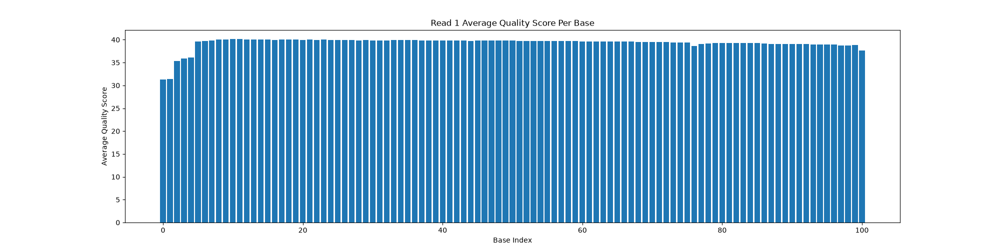
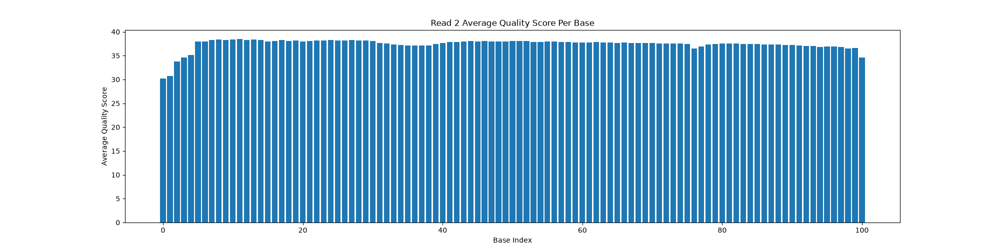
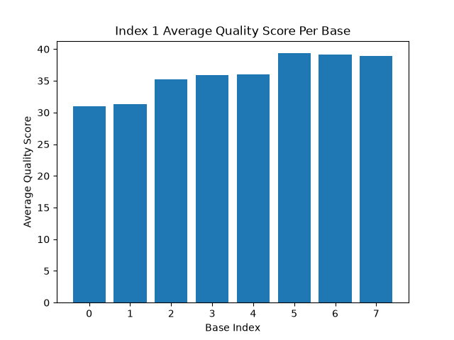
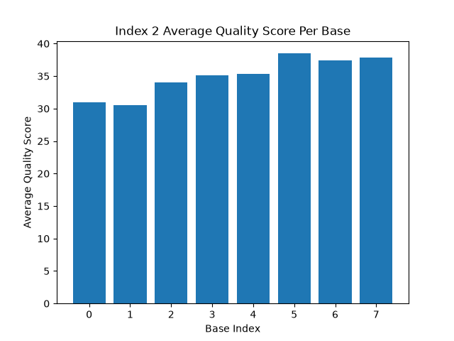

# Assignment the First

## Part 1
1. Be sure to upload your Python script. Provide a link to it here: [dists.py](dists.py)

| File name | label | Read length | Phred encoding |
|---|---|---|---|
| 1294_S1_L008_R1_001.fastq.gz | read1 | 101 | Phred+33 |
| 1294_S1_L008_R2_001.fastq.gz | index1 | 8 | Phred+33 |
| 1294_S1_L008_R3_001.fastq.gz | index2 | 8 | Phred+33 |
| 1294_S1_L008_R4_001.fastq.gz | read2 | 101 | Phred+33 |

Note: there are 1452986940 lines in each file, meaning there are 363,246,735 records total

2. Per-base NT distribution
    1. Use markdown to insert your 4 histograms here.
    
    
    
    

    2. The minimum hamming distance between any 2 indices is 3. I'm planning on doing error correction (I think just correcting up to 1 N, since there are very few with more), so I can't just throw out all reads with an N in the index. I think a good cutoff would be if an index has an average quality score below 25. At 25, the probability of error is ~0.00316. The probability that 3 or more bases in a sequence of 8 would be misread is ~1.75x10^-6. There are ~360 million records, so even with these odds we'd expect a fair number of such events, but only 18 of 576 index combinations have a hamming distance of 3, so the odds that the base call errors would occur in the right index, in the right locations of the index, and be changed to a base that matches another index seem astronomically low. Even if an N has been corrected, the odds that 2 more bases have had errors that make it match another index seem very low. I also want to balance this consideration with wanting to keep as much data as possible. If there is an N in a sequence of 8, the maximum average quality score possible is 35.25 (if the other 7 have scores of 40), so too high a cutoff may cause us to lose data, since it may isn't likely that all other bases have effectively perfect scores. With all this in mind, I think 25 is a reasonable cutoff to avoid losing too much data while also keeping the likelihood of error low.

    3. Count of indices with Ns:
    ```bash
    zcat 1294_S1_L008_R2_001.fastq.gz | grep -A 1 -E '^@' | grep -v -E '^@' | grep -c 'N'
    # 3976613
    zcat 1294_S1_L008_R3_001.fastq.gz | grep -A 1 -E '^@' | grep -v -E '^@' | grep -c 'N'
    # 3328051

    # Checking for multiple Ns:
    zcat 1294_S1_L008_R2_001.fastq.gz | grep -A 1 -E '^@' | grep -v -E '^@' | grep -c -E 'N.*N'
    # 0
    zcat 1294_S1_L008_R3_001.fastq.gz | grep -A 1 -E '^@' | grep -v -E '^@' | grep -c -E 'N.*N'
    # 1848
    ```

    There are 3,976,613 indices with Ns in R2 (~1.1%) and 3,328,051 indices with Ns in R3 (~0.92%). R2 has no indices with more than 1 N, and R3 has 1848 (<<< 1%).

## Part 2

**NOTE:** This is all contained in [Strategy.md](./Strategy.md)

1. Define the problem
2. Describe output
3. Upload your [4 input FASTQ files](../TEST-input_FASTQ) and your [>=6 expected output FASTQ files](../TEST-output_FASTQ).
4. Pseudocode
5. High level functions. For each function, be sure to include:
    1. Description/doc string
    2. Function headers (name and parameters)
    3. Test examples for individual functions
    4. Return statement
