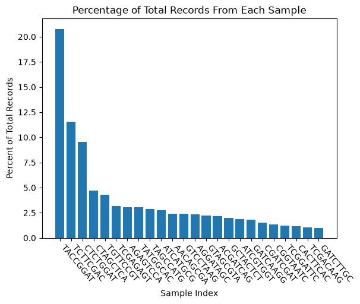

## Results
### General Stats
|Record Type|Count|Percent|
|-----------|-----|-------|
|Paired|328445568|90.42|
|Hopped|623324|0.17|
|Unknown|34177843|9.41|
|Total|363246735|100|
### Samples
|Index|Count|Percent|
|-----|-----|-------|
|TACCGGAT|75457183|20.77|
|TCTTCGAC|41858531|11.52|
|CTCTGGAT|34577923|9.52|
|CTAGCTCA|17183272|4.73|
|TGTTCCGT|15658738|4.31|
|TCGAGAGT|11588114|3.19|
|AGAGTCCA|11189921|3.08|
|TATGGCAC|11058284|3.04|
|TAGCCATG|10538889|2.9|
|ATCATGCG|9969496|2.74|
|AACAGCGA|8775809|2.42|
|GTCCTAAG|8743139|2.41|
|AGGATAGC|8600748|2.37|
|GTAGCGTA|8025975|2.21|
|ACGATCAG|7901592|2.18|
|GCTACTCT|7274840|2.0|
|ATCGTGGT|6835986|1.88|
|GATCAAGG|6528011|1.8|
|CGATCGAT|5565788|1.53|
|CGGTAATC|4956999|1.36|
|TCGGATTC|4545257|1.25|
|CACTTCAC|4166269|1.15|
|TCGACAAG|3815078|1.05|
|GATCTTGC|3629726|1.0|

### Hopped Records

|Index Pair|Count|
|-----|-----|
|TATGGCAC-TGTTCCGT|88128|
|TGTTCCGT-TATGGCAC|84716|
|TACCGGAT-CTCTGGAT|18101|
|GATCAAGG-TCTTCGAC|17604|
|CTAGCTCA-TCGACAAG|14471|
|CTCTGGAT-TACCGGAT|13011|
|TACCGGAT-TCTTCGAC|11297|
|TCTTCGAC-TACCGGAT|9800|
|TCGACAAG-ATCATGCG|7728|
|GTCCTAAG-TATGGCAC|6894|
|CGGTAATC-TACCGGAT|6821|
|CTCTGGAT-TCTTCGAC|5292|
|TCTTCGAC-CTCTGGAT|5274|
|TACCGGAT-TGTTCCGT|4569|
|TATGGCAC-TACCGGAT|4257|
|TCTTCGAC-ATCGTGGT|4236|
|TGTTCCGT-TACCGGAT|4075|
|TATGGCAC-TCTTCGAC|3972|
|TACCGGAT-CTAGCTCA|3937|
|TACCGGAT-TATGGCAC|3859|
|CTAGCTCA-TACCGGAT|3741|
|TACCGGAT-TCGAGAGT|3735|
|TACCGGAT-TAGCCATG|3619|
|CTAGCTCA-CTCTGGAT|3437|
|TCGAGAGT-TACCGGAT|3219|
|CACTTCAC-TAGCCATG|3134|
|TCTTCGAC-TGTTCCGT|2924|
|CTCTGGAT-CTAGCTCA|2706|
|TCTTCGAC-TATGGCAC|2591|
|TACCGGAT-CGGTAATC|2470|
|TGTTCCGT-TCTTCGAC|2434|
|TAGCCATG-TACCGGAT|2391|
|TCTTCGAC-CTAGCTCA|2381|
|TACCGGAT-GTCCTAAG|2346|
|TCTTCGAC-TCGAGAGT|2312|
|CTCTGGAT-GCTACTCT|2287|
|TACCGGAT-ATCGTGGT|2246|
|TACCGGAT-AGAGTCCA|2230|
|AGAGTCCA-TACCGGAT|2185|
|AACAGCGA-TACCGGAT|2169|
|TACCGGAT-ACGATCAG|2162|
|CTAGCTCA-TCTTCGAC|2150|
|CTCTGGAT-TGTTCCGT|2075|
|ATCATGCG-TACCGGAT|2062|
|TACCGGAT-ATCATGCG|2018|
|GTCCTAAG-TACCGGAT|2001|
|CTCTGGAT-CGATCGAT|1993|
|CTCTGGAT-TCGAGAGT|1983|
|TACCGGAT-AGGATAGC|1976|
|ACGATCAG-TACCGGAT|1936|
|AACAGCGA-TCTTCGAC|1895|
|TACCGGAT-AACAGCGA|1880|
|CGATCGAT-TACCGGAT|1851|
|TACCGGAT-CGATCGAT|1833|
|ATCGTGGT-TACCGGAT|1822|
|TCGAGAGT-TCTTCGAC|1773|
|TCTTCGAC-GATCAAGG|1767|
|CTAGCTCA-GCTACTCT|1698|
|CTCTGGAT-AGAGTCCA|1670|
|CTAGCTCA-ATCATGCG|1669|
|TACCGGAT-GATCAAGG|1665|
|AGGATAGC-TACCGGAT|1664|
|TCTTCGAC-AGGATAGC|1663|
|TGTTCCGT-CTCTGGAT|1651|
|TCGAGAGT-CTCTGGAT|1613|
|AGGATAGC-TCTTCGAC|1610|
|TACCGGAT-GTAGCGTA|1599|
|GCTACTCT-TACCGGAT|1569|
|GTAGCGTA-TACCGGAT|1558|
|ATCATGCG-TCTTCGAC|1527|
|TACCGGAT-GCTACTCT|1511|
|GTAGCGTA-GCTACTCT|1478|
|CTCTGGAT-TATGGCAC|1468|
|TCTTCGAC-TAGCCATG|1464|
|TCTTCGAC-ACGATCAG|1446|
|TATGGCAC-CTCTGGAT|1402|
|TCTTCGAC-TCGGATTC|1355|
|GATCAAGG-TACCGGAT|1346|
|TCTTCGAC-AGAGTCCA|1318|
|TACCGGAT-TCGGATTC|1314|
|TAGCCATG-TCTTCGAC|1271|
|ATCATGCG-CTCTGGAT|1262|
|TACCGGAT-CACTTCAC|1226|
|TCTTCGAC-ATCATGCG|1225|
|ATCGTGGT-CTCTGGAT|1220|
|ATCGTGGT-TCTTCGAC|1215|
|AGAGTCCA-TCTTCGAC|1197|
|CGATCGAT-CTCTGGAT|1160|
|TCTTCGAC-GTCCTAAG|1140|
|CTAGCTCA-GTAGCGTA|1133|
|TCTTCGAC-CGATCGAT|1126|
|TCGGATTC-TCTTCGAC|1111|
|CTCTGGAT-GTCCTAAG|1085|
|TACCGGAT-GATCTTGC|1072|
|CTCTGGAT-ACGATCAG|1071|
|GTCCTAAG-TCTTCGAC|1063|
|TCTTCGAC-GTAGCGTA|1062|
|CGATCGAT-TCTTCGAC|1059|
|GTAGCGTA-TCTTCGAC|1054|
|CTCTGGAT-TAGCCATG|1053|
|ACGATCAG-TCTTCGAC|1047|
|AGAGTCCA-CTAGCTCA|1041|
|CTCTGGAT-ATCATGCG|1036|
|TCTTCGAC-GCTACTCT|1031|
|CGGTAATC-TCTTCGAC|1022|
|AACAGCGA-CTCTGGAT|1020|
|CTAGCTCA-AGAGTCCA|1015|
|CTCTGGAT-ATCGTGGT|996|
|TCGGATTC-AACAGCGA|987|
|GCTACTCT-CTCTGGAT|986|
|TCTTCGAC-CGGTAATC|984|
|GCTACTCT-TCTTCGAC|973|
|AGAGTCCA-GTAGCGTA|972|
|CTAGCTCA-TCGAGAGT|969|
|TCGGATTC-TACCGGAT|964|
|AGAGTCCA-CTCTGGAT|958|
|CACTTCAC-TACCGGAT|933|
|TACCGGAT-TCGACAAG|933|
|GTCCTAAG-CTCTGGAT|930|
|AGAGTCCA-TCGAGAGT|927|
|TCTTCGAC-GATCTTGC|915|
|AGGATAGC-GTAGCGTA|906|
|CTCTGGAT-GTAGCGTA|905|
|TATGGCAC-TCGGATTC|904|
|TAGCCATG-CTCTGGAT|901|
|TCGAGAGT-TGTTCCGT|901|
|TCTTCGAC-AACAGCGA|896|
|TCTTCGAC-CACTTCAC|889|
|CTCTGGAT-AGGATAGC|885|
|CTAGCTCA-TGTTCCGT|880|
|GTAGCGTA-CTAGCTCA|866|
|ACGATCAG-CTCTGGAT|865|
|TCTTCGAC-TCGACAAG|863|
|GTCCTAAG-TGTTCCGT|860|
|CTCTGGAT-AACAGCGA|856|
|TGTTCCGT-CTAGCTCA|842|
|CACTTCAC-TCTTCGAC|839|
|TATGGCAC-TCGAGAGT|835|
|TGTTCCGT-TCGAGAGT|829|
|TGTTCCGT-TCGGATTC|814|
|AGGATAGC-CTCTGGAT|802|
|TCGACAAG-TACCGGAT|798|
|GTAGCGTA-CTCTGGAT|773|
|ATCATGCG-TAGCCATG|771|
|CTAGCTCA-TATGGCAC|759|
|GTAGCGTA-ACGATCAG|742|
|TATGGCAC-CTAGCTCA|736|
|CTCTGGAT-CGGTAATC|727|
|TGTTCCGT-AACAGCGA|722|
|ATCATGCG-TATGGCAC|717|
|CTAGCTCA-TAGCCATG|715|
|ATCATGCG-ACGATCAG|699|
|TGTTCCGT-AGAGTCCA|679|
|TATGGCAC-GTCCTAAG|677|
|GATCTTGC-TACCGGAT|676|
|GTAGCGTA-TCGAGAGT|675|
|CTAGCTCA-ACGATCAG|674|
|CTCTGGAT-GATCAAGG|657|
|TCGAGAGT-CTAGCTCA|656|
|GATCTTGC-TCTTCGAC|649|
|CTCTGGAT-CACTTCAC|648|
|TCGACAAG-TCTTCGAC|637|
|CTCTGGAT-TCGGATTC|634|
|ATCATGCG-CTAGCTCA|630|
|GATCAAGG-CTCTGGAT|620|
|TCGAGAGT-ACGATCAG|615|
|AGAGTCCA-TGTTCCGT|613|
|TATGGCAC-AACAGCGA|610|
|CACTTCAC-CTCTGGAT|604|
|TAGCCATG-CTAGCTCA|599|
|ATCATGCG-GTCCTAAG|584|
|GCTACTCT-GTAGCGTA|583|
|TGTTCCGT-ATCATGCG|579|
|AACAGCGA-GATCTTGC|577|
|GCTACTCT-CTAGCTCA|576|
|ATCATGCG-TGTTCCGT|574|
|TCGAGAGT-GCTACTCT|569|
|ATCGTGGT-GATCAAGG|569|
|CGGTAATC-CTCTGGAT|563|
|CTAGCTCA-GTCCTAAG|550|
|AACAGCGA-ATCATGCG|543|
|TAGCCATG-TGTTCCGT|535|
|CTCTGGAT-GATCTTGC|535|
|TATGGCAC-AGGATAGC|535|
|AACAGCGA-CTAGCTCA|531|
|AGAGTCCA-ACGATCAG|526|
|GCTACTCT-TGTTCCGT|516|
|AGGATAGC-TATGGCAC|514|
|ATCATGCG-ATCGTGGT|512|
|CTAGCTCA-CGATCGAT|504|
|TGTTCCGT-TAGCCATG|504|
|TCGGATTC-CTCTGGAT|503|
|TATGGCAC-TAGCCATG|502|
|CTAGCTCA-AACAGCGA|502|
|ACGATCAG-CTAGCTCA|502|
|GATCAAGG-ACGATCAG|500|
|TGTTCCGT-CGATCGAT|499|
|ATCATGCG-AGAGTCCA|494|
|ATCATGCG-AGGATAGC|493|
|CTAGCTCA-AGGATAGC|491|
|AGGATAGC-CTAGCTCA|486|
|CTCTGGAT-TCGACAAG|482|
|TGTTCCGT-ACGATCAG|482|
|AGGATAGC-ACGATCAG|478|
|TATGGCAC-ACGATCAG|472|
|AGGATAGC-GATCTTGC|471|
|AACAGCGA-TGTTCCGT|471|
|ACGATCAG-TGTTCCGT|471|
|TGTTCCGT-AGGATAGC|470|
|GTAGCGTA-TGTTCCGT|465|
|GTCCTAAG-CTAGCTCA|464|
|AGGATAGC-TGTTCCGT|463|
|AACAGCGA-AGAGTCCA|461|
|ATCATGCG-AACAGCGA|460|
|CGATCGAT-TGTTCCGT|458|
|ACGATCAG-TCGAGAGT|457|
|AGGATAGC-TCGAGAGT|456|
|AGAGTCCA-AGGATAGC|456|
|TGTTCCGT-GTAGCGTA|454|
|AGGATAGC-AGAGTCCA|453|
|AACAGCGA-ACGATCAG|451|
|ATCGTGGT-TCGAGAGT|448|
|GTAGCGTA-AGAGTCCA|444|
|TCGAGAGT-AGGATAGC|444|
|ACGATCAG-AGAGTCCA|442|
|TATGGCAC-AGAGTCCA|439|
|ATCATGCG-GATCAAGG|439|
|AACAGCGA-AGGATAGC|438|
|AGGATAGC-ATCATGCG|432|
|TATGGCAC-CACTTCAC|428|
|CTAGCTCA-ATCGTGGT|423|
|AGAGTCCA-TATGGCAC|421|
|TCGAGAGT-TATGGCAC|420|
|ACGATCAG-GTCCTAAG|418|
|ACGATCAG-TAGCCATG|412|
|TGTTCCGT-GCTACTCT|412|
|TGTTCCGT-ATCGTGGT|410|
|AGAGTCCA-AACAGCGA|409|
|AACAGCGA-TATGGCAC|408|
|TCGAGAGT-ATCGTGGT|406|
|TCGAGAGT-AGAGTCCA|399|
|TAGCCATG-TATGGCAC|398|
|TAGCCATG-TCGAGAGT|395|
|ACGATCAG-ATCATGCG|393|
|CGATCGAT-CTAGCTCA|392|
|ATCATGCG-TCGAGAGT|392|
|AACAGCGA-TCGAGAGT|391|
|AACAGCGA-GTAGCGTA|389|
|GTCCTAAG-TAGCCATG|388|
|GTCCTAAG-AACAGCGA|386|
|TATGGCAC-ATCATGCG|385|
|AGAGTCCA-ATCATGCG|385|
|GATCAAGG-ATCGTGGT|384|
|GCTACTCT-AGAGTCCA|383|
|GATCAAGG-GTCCTAAG|383|
|ATCGTGGT-TGTTCCGT|383|
|CTAGCTCA-GATCAAGG|381|
|ACGATCAG-AGGATAGC|379|
|GTCCTAAG-GATCAAGG|373|
|TAGCCATG-GTCCTAAG|372|
|TCGACAAG-CTCTGGAT|372|
|TGTTCCGT-GTCCTAAG|370|
|GTCCTAAG-ATCATGCG|368|
|ACGATCAG-TATGGCAC|365|
|TCGAGAGT-TAGCCATG|364|
|GCTACTCT-TCGAGAGT|362|
|TAGCCATG-ACGATCAG|362|
|TCGGATTC-TATGGCAC|362|
|ATCGTGGT-CTAGCTCA|360|
|AACAGCGA-ATCGTGGT|355|
|CTAGCTCA-TCGGATTC|354|
|GTAGCGTA-GTCCTAAG|350|
|GTCCTAAG-ACGATCAG|348|
|TCGAGAGT-TCGGATTC|346|
|GATCTTGC-CTCTGGAT|343|
|AGGATAGC-CACTTCAC|337|
|TAGCCATG-GATCAAGG|336|
|TATGGCAC-GATCTTGC|336|
|CTAGCTCA-CGGTAATC|336|
|TAGCCATG-ATCATGCG|335|
|CACTTCAC-ACGATCAG|334|
|TAGCCATG-AGAGTCCA|333|
|GATCAAGG-TAGCCATG|333|
|AACAGCGA-TCGGATTC|330|
|AGAGTCCA-TAGCCATG|330|
|ACGATCAG-CGATCGAT|330|
|TCGACAAG-TCGAGAGT|329|
|TGTTCCGT-GATCAAGG|329|
|AGGATAGC-GCTACTCT|328|
|GATCAAGG-TGTTCCGT|327|
|TCGAGAGT-GTCCTAAG|324|
|GTCCTAAG-GTAGCGTA|323|
|CACTTCAC-TATGGCAC|322|
|TCGAGAGT-ATCATGCG|322|
|GATCTTGC-AGGATAGC|321|
|CGGTAATC-ATCGTGGT|320|
|AGAGTCCA-GTCCTAAG|317|
|ACGATCAG-TCGACAAG|317|
|TATGGCAC-CGGTAATC|308|
|TCGAGAGT-CGATCGAT|307|
|GTCCTAAG-TCGAGAGT|306|
|ATCGTGGT-AGAGTCCA|306|
|GTCCTAAG-AGAGTCCA|303|
|TCGAGAGT-GTAGCGTA|303|
|GCTACTCT-ACGATCAG|302|
|TCGGATTC-CTAGCTCA|300|
|ACGATCAG-GCTACTCT|300|
|AGGATAGC-AACAGCGA|299|
|TCGAGAGT-AACAGCGA|299|
|GTAGCGTA-TATGGCAC|298|
|TATGGCAC-GTAGCGTA|297|
|CACTTCAC-CTAGCTCA|297|
|ACGATCAG-GATCAAGG|297|
|TGTTCCGT-GATCTTGC|296|
|AACAGCGA-GTCCTAAG|294|
|CTAGCTCA-GATCTTGC|294|
|AGGATAGC-TAGCCATG|293|
|AACAGCGA-TAGCCATG|292|
|TCGACAAG-TAGCCATG|291|
|TATGGCAC-GCTACTCT|289|
|AGAGTCCA-GCTACTCT|289|
|ATCGTGGT-ATCATGCG|289|
|TATGGCAC-GATCAAGG|286|
|AACAGCGA-CGATCGAT|286|
|CGGTAATC-TAGCCATG|285|
|CGGTAATC-CTAGCTCA|285|
|AACAGCGA-GATCAAGG|283|
|GTAGCGTA-AACAGCGA|281|
|CTAGCTCA-CACTTCAC|279|
|GATCAAGG-CTAGCTCA|278|
|AGGATAGC-TCGGATTC|278|
|TATGGCAC-ATCGTGGT|276|
|ATCGTGGT-ACGATCAG|276|
|ATCATGCG-TCGACAAG|275|
|GCTACTCT-TATGGCAC|273|
|AGAGTCCA-ATCGTGGT|273|
|TCGGATTC-GATCTTGC|272|
|GTAGCGTA-ATCATGCG|270|
|TCGAGAGT-TCGACAAG|270|
|ATCATGCG-GCTACTCT|268|
|GTAGCGTA-TAGCCATG|268|
|ATCATGCG-GTAGCGTA|267|
|CGATCGAT-AGGATAGC|266|
|GCTACTCT-GTCCTAAG|263|
|AGGATAGC-CGGTAATC|263|
|CGATCGAT-TCGAGAGT|262|
|GATCAAGG-TCGAGAGT|261|
|TCGAGAGT-GATCAAGG|261|
|TAGCCATG-GTAGCGTA|259|
|TCGACAAG-ACGATCAG|259|
|CGGTAATC-AGGATAGC|258|
|TAGCCATG-AGGATAGC|256|
|GCTACTCT-ATCATGCG|253|
|TGTTCCGT-CACTTCAC|253|
|GTCCTAAG-TCGGATTC|251|
|TCGGATTC-AGGATAGC|250|
|ACGATCAG-AACAGCGA|250|
|ATCGTGGT-TATGGCAC|250|
|GTAGCGTA-ATCGTGGT|249|
|AGAGTCCA-CGATCGAT|245|
|CACTTCAC-TGTTCCGT|244|
|CGGTAATC-TGTTCCGT|243|
|GTCCTAAG-GCTACTCT|242|
|CGATCGAT-ACGATCAG|241|
|TCGGATTC-TGTTCCGT|241|
|CGATCGAT-AGAGTCCA|240|
|TATGGCAC-CGATCGAT|239|
|GTCCTAAG-AGGATAGC|239|
|GTAGCGTA-AGGATAGC|238|
|AGGATAGC-CGATCGAT|237|
|AGGATAGC-GTCCTAAG|237|
|GATCAAGG-ATCATGCG|236|
|TCGGATTC-TCGAGAGT|236|
|ACGATCAG-GTAGCGTA|236|
|TGTTCCGT-CGGTAATC|236|
|ATCGTGGT-AGGATAGC|235|
|GATCAAGG-TATGGCAC|233|
|TATGGCAC-TCGACAAG|233|
|GCTACTCT-TAGCCATG|232|
|GATCAAGG-GATCTTGC|231|
|TAGCCATG-CACTTCAC|229|
|ATCATGCG-GATCTTGC|229|
|AGGATAGC-ATCGTGGT|227|
|TCGGATTC-CGATCGAT|227|
|TCGAGAGT-CGGTAATC|225|
|CGGTAATC-TATGGCAC|224|
|ATCGTGGT-GCTACTCT|223|
|ATCGTGGT-GTAGCGTA|223|
|ATCATGCG-CGATCGAT|218|
|GTCCTAAG-CGATCGAT|218|
|GATCAAGG-GTAGCGTA|216|
|GATCAAGG-AGAGTCCA|216|
|GATCTTGC-TATGGCAC|213|
|TAGCCATG-AACAGCGA|212|
|GTCCTAAG-ATCGTGGT|212|
|TAGCCATG-TCGACAAG|211|
|GATCAAGG-AGGATAGC|211|
|GCTACTCT-AGGATAGC|207|
|TGTTCCGT-TCGACAAG|207|
|CACTTCAC-CGGTAATC|206|
|GTAGCGTA-GATCAAGG|206|
|GCTACTCT-AACAGCGA|205|
|TCGACAAG-GTCCTAAG|205|
|TCGACAAG-CTAGCTCA|203|
|GATCAAGG-GCTACTCT|202|
|AGAGTCCA-GATCAAGG|202|
|ACGATCAG-ATCGTGGT|202|
|GATCTTGC-ATCATGCG|201|
|CGATCGAT-TAGCCATG|198|
|TAGCCATG-GCTACTCT|195|
|ATCGTGGT-CGATCGAT|195|
|TCGACAAG-TGTTCCGT|193|
|CGATCGAT-GTCCTAAG|190|
|GATCTTGC-CTAGCTCA|190|
|GATCTTGC-CGATCGAT|187|
|GTCCTAAG-GATCTTGC|187|
|TAGCCATG-ATCGTGGT|186|
|GTAGCGTA-CGATCGAT|186|
|TCGGATTC-ACGATCAG|185|
|AACAGCGA-GCTACTCT|185|
|TCGAGAGT-GATCTTGC|185|
|GCTACTCT-GATCAAGG|184|
|CACTTCAC-AGGATAGC|184|
|CGGTAATC-CACTTCAC|184|
|AGAGTCCA-CGGTAATC|182|
|CGATCGAT-GTAGCGTA|181|
|TAGCCATG-TCGGATTC|180|
|CGATCGAT-CGGTAATC|179|
|CGGTAATC-CGATCGAT|179|
|ATCGTGGT-TAGCCATG|178|
|GCTACTCT-CGATCGAT|177|
|GATCAAGG-CGATCGAT|176|
|GATCAAGG-AACAGCGA|176|
|ATCGTGGT-AACAGCGA|176|
|TCGGATTC-CGGTAATC|175|
|CGATCGAT-TATGGCAC|174|
|GCTACTCT-ATCGTGGT|173|
|AGAGTCCA-TCGGATTC|173|
|ACGATCAG-CGGTAATC|173|
|TCGGATTC-AGAGTCCA|172|
|CGATCGAT-GCTACTCT|170|
|CGGTAATC-TCGAGAGT|170|
|GATCTTGC-GATCAAGG|169|
|AGAGTCCA-CACTTCAC|169|
|AGGATAGC-GATCAAGG|168|
|CGATCGAT-ATCATGCG|167|
|GATCTTGC-TGTTCCGT|165|
|ATCATGCG-TCGGATTC|165|
|CACTTCAC-CGATCGAT|164|
|ATCGTGGT-GTCCTAAG|164|
|ATCATGCG-CGGTAATC|163|
|ACGATCAG-CACTTCAC|163|
|CACTTCAC-AGAGTCCA|161|
|GTCCTAAG-TCGACAAG|160|
|GATCTTGC-AGAGTCCA|158|
|AACAGCGA-CACTTCAC|155|
|ACGATCAG-GATCTTGC|154|
|TCGGATTC-TAGCCATG|153|
|TCGACAAG-AGGATAGC|153|
|TAGCCATG-GATCTTGC|152|
|GATCTTGC-ACGATCAG|152|
|CGGTAATC-AGAGTCCA|152|
|ATCATGCG-CACTTCAC|151|
|GATCTTGC-AACAGCGA|150|
|TCGACAAG-TATGGCAC|150|
|ACGATCAG-TCGGATTC|150|
|TAGCCATG-CGATCGAT|149|
|GCTACTCT-GATCTTGC|146|
|TAGCCATG-CGGTAATC|146|
|ATCGTGGT-CGGTAATC|146|
|GATCTTGC-GTCCTAAG|145|
|CGATCGAT-GATCAAGG|144|
|CACTTCAC-TCGAGAGT|144|
|TCGAGAGT-CACTTCAC|144|
|CGATCGAT-ATCGTGGT|143|
|AGAGTCCA-GATCTTGC|141|
|CGGTAATC-ACGATCAG|141|
|CGGTAATC-TCGGATTC|140|
|CGGTAATC-GATCAAGG|139|
|CGGTAATC-ATCATGCG|137|
|CGATCGAT-AACAGCGA|136|
|GATCTTGC-TCGAGAGT|135|
|TCGGATTC-ATCATGCG|133|
|GTAGCGTA-TCGGATTC|133|
|TCGGATTC-GTCCTAAG|132|
|AACAGCGA-CGGTAATC|132|
|ATCGTGGT-TCGGATTC|131|
|TCGACAAG-GATCAAGG|130|
|GATCTTGC-GTAGCGTA|129|
|CACTTCAC-ATCATGCG|129|
|CACTTCAC-TCGGATTC|123|
|GATCAAGG-TCGACAAG|120|
|GTAGCGTA-CGGTAATC|120|
|GTAGCGTA-GATCTTGC|119|
|GCTACTCT-TCGGATTC|118|
|TCGACAAG-AGAGTCCA|118|
|GCTACTCT-CGGTAATC|116|
|AGAGTCCA-TCGACAAG|116|
|GTCCTAAG-CGGTAATC|116|
|GATCTTGC-CGGTAATC|115|
|CACTTCAC-GTCCTAAG|115|
|ATCGTGGT-GATCTTGC|115|
|GATCTTGC-GCTACTCT|114|
|AGGATAGC-TCGACAAG|114|
|AACAGCGA-TCGACAAG|113|
|CGATCGAT-CACTTCAC|112|
|CGGTAATC-GTAGCGTA|111|
|CGGTAATC-GTCCTAAG|110|
|TCGGATTC-GATCAAGG|109|
|TCGGATTC-GTAGCGTA|109|
|CGGTAATC-GCTACTCT|109|
|CGGTAATC-GATCTTGC|109|
|CGATCGAT-GATCTTGC|108|
|CGATCGAT-TCGGATTC|106|
|GTCCTAAG-CACTTCAC|106|
|GATCTTGC-TAGCCATG|103|
|GATCAAGG-CGGTAATC|103|
|CGGTAATC-AACAGCGA|102|
|TCGGATTC-ATCGTGGT|101|
|CACTTCAC-AACAGCGA|101|
|CACTTCAC-GTAGCGTA|100|
|GTAGCGTA-TCGACAAG|100|
|TCGGATTC-CACTTCAC|99|
|CGATCGAT-TCGACAAG|98|
|GATCTTGC-CACTTCAC|98|
|TCGACAAG-TCGGATTC|98|
|CACTTCAC-GATCAAGG|98|
|GATCAAGG-TCGGATTC|97|
|TCGACAAG-CGATCGAT|97|
|ATCGTGGT-TCGACAAG|96|
|TCGACAAG-GCTACTCT|95|
|TCGGATTC-GCTACTCT|94|
|CACTTCAC-GATCTTGC|91|
|CACTTCAC-ATCGTGGT|89|
|TCGACAAG-GTAGCGTA|87|
|GTAGCGTA-CACTTCAC|87|
|GATCAAGG-CACTTCAC|85|
|TCGACAAG-AACAGCGA|85|
|CACTTCAC-GCTACTCT|85|
|GCTACTCT-TCGACAAG|84|
|GCTACTCT-CACTTCAC|84|
|TCGACAAG-ATCGTGGT|81|
|ATCGTGGT-CACTTCAC|80|
|TCGGATTC-TCGACAAG|78|
|GATCTTGC-TCGGATTC|77|
|GATCTTGC-ATCGTGGT|75|
|CGGTAATC-TCGACAAG|59|
|CACTTCAC-TCGACAAG|54|
|TCGACAAG-GATCTTGC|51|
|TCGACAAG-CGGTAATC|46|
|GATCTTGC-TCGACAAG|42|
|TCGACAAG-CACTTCAC|28|
